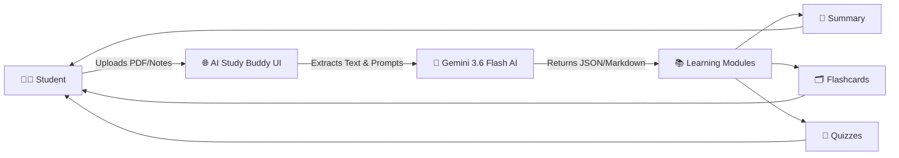
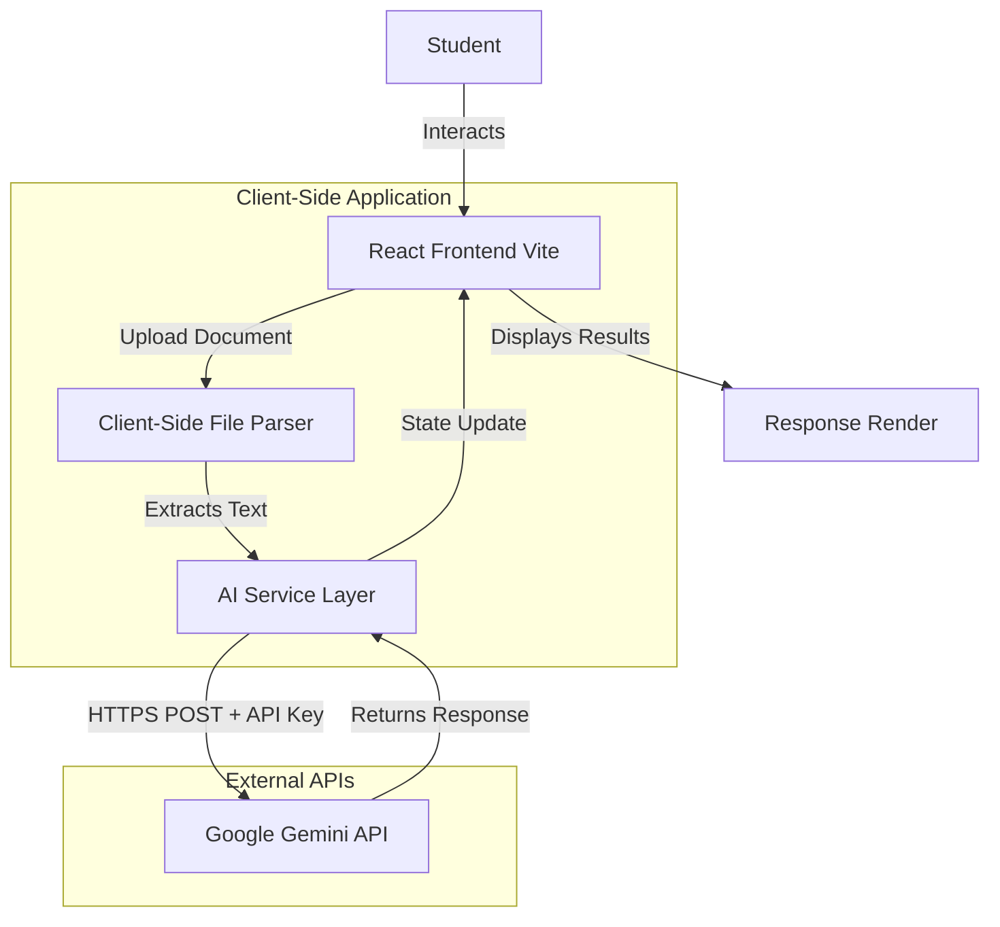

<div align="center">
  
  <h1>🧠 AI Study Buddy</h1>
  <p><b>Your AI-powered companion for smarter, personalized, and efficient learning.</b></p>

  <a href="https://ai-study-buddy-two-zeta.vercel.app/"></a>
  <a href="https://github.com/Pravalika-Tech27/AI_Study_Buddy.git"></a>
  
  <br />
  
  
  
  
  
  
  <br/>
  
  <i>🚀 Live Demo | 🤖 AI Powered | 💻 Open Source Project</i>
</div>

---

### 🧭 Quick Navigation
[Overview](#-project-overview) • [Features](#-key-features) • [Architecture](#-system-architecture) • [Tech Stack](#️-tech-stack) • [Setup](#-getting-started) • [Deployment](#-deployment) • [Future Scope](#-future-enhancements)

---

## 📖 Project Overview

**AI Study Buddy** is an intelligent, frontend-focused web application designed to transform static study materials into interactive, bite-sized learning experiences. By simply uploading notes or documents, students can instantly generate summaries, interactive flashcards, and quizzes, or ask specific questions directly to an AI tutor. 

**Designed for:** Students, researchers, and lifelong learners who want to maximize their study efficiency.  
**Problem solved:** The overwhelming nature of long PDFs and dense lecture notes.  
**Why it is useful:** It actively forces recall and active learning through quizzes and flashcards, which are proven to improve retention compared to passive reading.

---

## ⚖️ Problem → Solution

| 😟 Students Face | 🚀 AI Study Buddy |
| :--- | :--- |
| **Information Overload** from reading 50-page PDFs | **Smart Summaries** that distill key concepts |
| **Time-consuming creation** of study materials | **Instant Flashcard Generation** from raw text |
| **Exam Anxiety** and lack of practice tests | **Auto-Generated Quizzes** to test knowledge |
| **Getting Stuck** on complex topics | **Interactive AI Chat** for personalized explanations |

---

## ✨ Key Features

- **📄 Universal Document Upload:** Drop PDFs, Word documents (.doc/.docx), Markdown, or plain text directly into the app.
- **📝 Instant Summarization:** Distills long, complex notes into structured, easy-to-read markdown bullet points.
- **🗂️ Smart Flashcards:** Automatically generates 8-10 targeted Q&A flashcards for active recall practice.
- **🎯 Auto-Generated Quizzes:** Creates 5-question multiple-choice quizzes complete with correct answers to test your readiness.
- **💬 Contextual AI Chat:** Ask questions and get answers based strictly on the context of the study material you uploaded.

---

## 🧠 How It Works



---

## 🏗️ System Architecture

The application runs entirely in the browser, interacting directly with the Google Gemini API to eliminate the need for a complex backend infrastructure.



---

## 🛠️ Tech Stack

| Technology | Purpose |
| :--- | :--- |
| **React 18** | Core UI library for building interactive components |
| **Vite** | Lightning-fast build tool and development server |
| **Tailwind CSS** | Utility-first styling for a beautiful, responsive design |
| **shadcn/ui** | Accessible, customizable pre-built UI components |
| **Framer Motion** | Smooth animations and transitions |
| **Google Gemini API** | Advanced LLM used for text extraction and content generation |

---

## 📂 Project Structure

```text
AI_Study_Buddy/
├── public/                 # Static assets (Favicon)
├── src/
│   ├── components/         # React components
│   │   ├── ui/             # shadcn reusable UI components
│   │   ├── ChatInterface.tsx
│   │   ├── FlashcardView.tsx
│   │   ├── QuizView.tsx
│   │   ├── SummaryView.tsx
│   │   └── UploadArea.tsx  # Handles file parsing and upload logic
│   ├── hooks/              # Custom React hooks
│   ├── lib/
│   │   ├── ai-service.ts   # Directly connects to Gemini API
│   │   └── utils.ts        # Helper functions
│   ├── pages/              # Main view pages (Index.tsx)
│   ├── App.tsx             # Root component and router
│   └── main.tsx            # Application entry point
├── .env                    # Environment variables
├── index.html              # HTML template
├── tailwind.config.ts      # Tailwind configuration
├── vercel.json             # Vercel deployment configuration
└── README.md
```

---

## 🚀 Getting Started

### Prerequisites
- Node.js (v18 or higher)
- A Google Gemini API Key

### Installation

1. **Clone the repository:**
   ```bash
   git clone https://github.com/Pravalika-Tech27/AI_Study_Buddy.git
   cd AI_Study_Buddy/AI-study-buddy
   ```

2. **Install dependencies:**
   ```bash
   npm install
   ```

3. **Set up Environment Variables:** (See below)

4. **Run the development server:**
   ```bash
   npm run dev
   ```

5. **Open in browser:**
   Navigate to `http://localhost:8080`

---

## 🔐 Environment Variables

This project requires a Google Gemini API Key to function. Get one for free from [Google AI Studio](https://aistudio.google.com/app/apikey).

Create a `.env` file in the root directory and add your key:

```env
VITE_GEMINI_API_KEY="your_api_key_here"
```

> ⚠️ **Warning:** Never commit your `.env` file to version control. It is already added to `.gitignore`.

---

## 🌐 Deployment

**Live Application:** [https://ai-study-buddy-two-zeta.vercel.app/](https://ai-study-buddy-two-zeta.vercel.app/)

This project is configured for seamless deployment on **Vercel**.
1. Push your code to GitHub.
2. Import the repository in your Vercel Dashboard.
3. Ensure the **Root Directory** is set appropriately.
4. Add the `VITE_GEMINI_API_KEY` to Vercel's Environment Variables.
5. Deploy! (The included `vercel.json` automatically configures Vite's `dist` output directory).

---

## 📸 Screenshots

| Feature | Preview |
| :---: | :---: |
| **Home & Upload** | *(Upload your document to see AI magic in action)* |
| **Smart Summaries** | *(Organized markdown bullet points)* |
| **Interactive Flashcards** | *(Flippable Q&A cards)* |
| **Quizzes** | *(Multiple choice testing)* |

*(Note: Add project screenshots here to showcase the beautiful UI!)*

---

## 🎯 Use Cases

- **Exam Preparation:** Quickly generate practice quizzes from last week's lecture notes.
- **Understanding Difficult Concepts:** Ask the AI Chat to "explain this topic like I am 5 years old" based on the uploaded material.
- **Active Recall Revision:** Use the auto-generated flashcards on your phone right before a test.
- **Research Consolidation:** Upload research papers to get immediate, structured summaries.

---

## 🌟 Why AI Study Buddy?

While generic tools like ChatGPT exist, **AI Study Buddy** provides a focused, distraction-free environment specifically tailored for learning. It instantly provides the three most effective study methodologies (Summaries, Flashcards, and Quizzes) in one click, without requiring complex prompt engineering from the user. It is lightweight, fast, and completely runs in the browser without an expensive backend infrastructure.

---

## 🔮 Future Enhancements

- [ ] **📅 AI Study Planner:** Automatically schedule revision sessions based on spaced repetition.
- [ ] **📊 Progress Tracking:** Save quiz scores to track learning progress over time.
- [ ] **🎤 Voice Interaction:** Read flashcards aloud and accept verbal answers.
- [ ] **📂 Multi-Document Support:** Upload multiple files at once to generate a comprehensive study guide.

---

## 🤝 Contributing

Contributions are always welcome!
1. Fork the project.
2. Create your feature branch (`git checkout -b feature/AmazingFeature`).
3. Commit your changes (`git commit -m 'Add some AmazingFeature'`).
4. Push to the branch (`git push origin feature/AmazingFeature`).
5. Open a Pull Request.

---

## 📄 License

Currently, no license file is included with this repository.

---

## 👩‍💻 Author

Created by [Pravalika-Tech27](https://github.com/Pravalika-Tech27).

---
<div align="center">
  <i>Built with ❤️ for a smarter way to study.</i>
</div>
